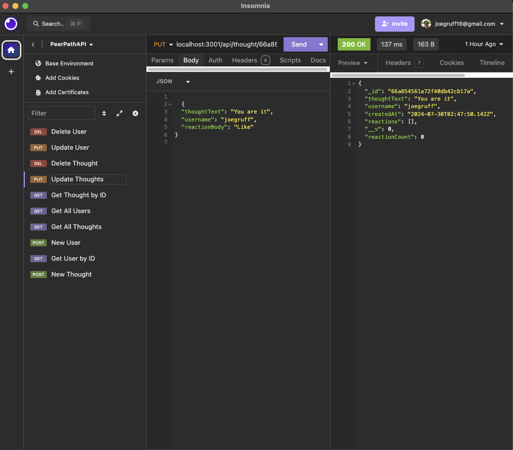
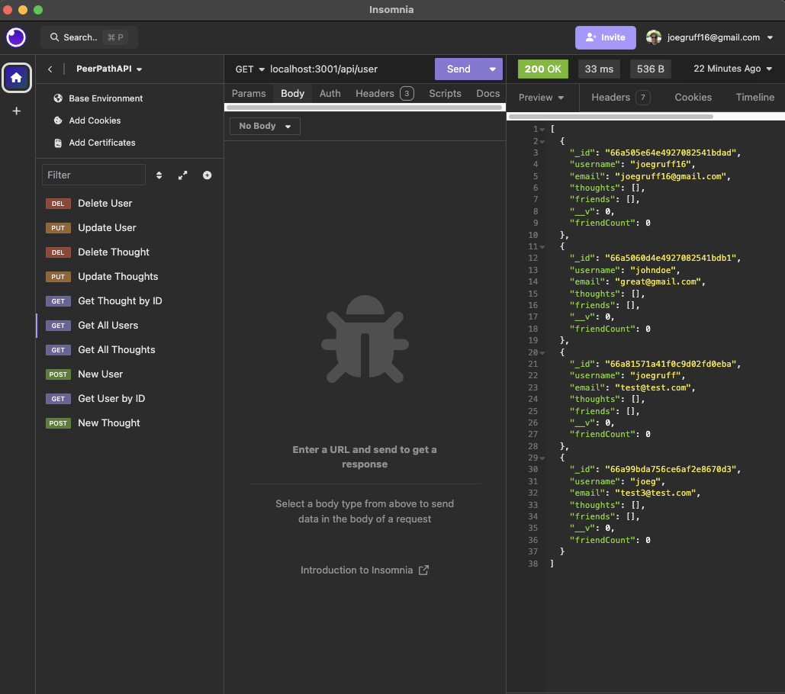

# PeerPath-API

## Description

This backend app uses a custom API to simulate a social media platform, allowing users to share thoughts, react to friends' thoughts, and create a friend list.

## Finished Product

## Usage

-  
-  
-  
- 

## License

## Video Link

<https://drive.google.com/file/d/1-PBfNzfuoMLNWl25tV_g83dpI89iBmzp/view?usp=sharing>

## GitHub Repo

<https://github.com/joegruff16/PeerPath-API>

## Credits

- Used this github to add usage markdown badges
  - **<https://github.com/Ileriayo/markdown-badges>**
- Added this license badge
  - **<https://gist.github.com/lukas-h/2a5d00690736b4c3a7ba>**
- Added Mongoose Badge
  - **<https://home.aveek.io/GitHub-Profile-Badges/>**
